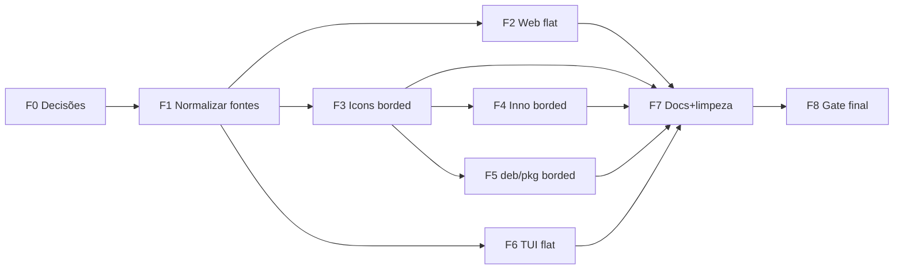

# PLAN — Atualização completa dos logos (Desktop, TUI/CLI, instaladores, interface)

> Status: PLANO (aguardando aprovação para execução pelo agente Build)
> Origem dos novos assets: `img-logos/`
> Data: 2026-09-09
> Decisão do usuário (2026-09-09): **sem borda = dentro do aplicativo (interface + ASCII da TUI)**; **com borda = OS/instaladores/bundle nativo**.

## 1. Objetivo

Substituir todos os logos antigos do HysCode (família `hyscode-logo.*`, `favicon.png`, `logo hyscode.*`, set atual em `apps/desktop/src-tauri/icons/`, ASCII art em `tools/hyscode-tui/src/logo.ts`) pelos novos logos Vortex disponíveis em `img-logos/`, de forma completa e consistente em:

1. Interface desktop (React: favicon, BrandMark, welcome, onboarding, titlebar, about, editor-welcome, sidebar) — **SEM borda**.
2. TUI/CLI Vortex (`logo.ts` ASCII, `renderer.ts`, `--help`) — **SEM borda** (rasterizado do PNG sem borda).
3. Bundle nativo Tauri (ícones `icons/`, `tauri.conf.json`, janela, dock/taskbar) — **COM borda**.
4. Instaladores Windows (NSIS via Tauri + Inno `hyscode.iss` + `vortex-cli.iss` standalone) — **COM borda**.
5. Instaladores Linux/macOS (`.deb` desktop + `package-vortex-deb.mjs`, `.pkg` via `package-vortex-macos.mjs`, AppImage) — **COM borda** (herdado do bundle / hicolor).
6. Docs/site do repo (`README.md`, `docs/`, `index.html` title/meta se aplicável).
7. Limpeza de assets obsoletos e correção de referência quebrada no README.

Regra consolidada: **SEM borda dentro do app e da TUI; COM borda (`_borded`) no desktop OS-level (ícone do app, taskbar/dock) e nos ícones de instaladores**.

## 2. Inventário — o que foi mapeado

### 2.1 Novos assets (origem)

| Arquivo em `img-logos/` | Tamanho | Conteúdo observado | Uso definido |
|---|---|---|---|
| `Vortex_new logo png.png` | 73 KB | Vortex verde sem borda | Fonte raster **in-app/TUI**: favicon PNG, `public/` fallback, referência de rasterização do ASCII da TUI |
| `Vortex_new logo png_borded.png` | 132 KB | Vortex verde **com borda preta** | **FONTE CANÔNICA OS-level**: set `src-tauri/icons/` (png/ico/icns), instaladores (NSIS/Inno header+setup icon), Store logos |
| `vortex_new_desktop_logo.svg` | 5,3 KB | Vetor verde com `stroke:black;stroke-width:13.7px` | Reserva / variante com borda (instalador docs, OGP grande). NÃO é o logo in-app |
| `vortex_new_desktop_logo2.svg` | ~5 KB | Mesmo vetor **sem stroke** | **Logo vetorial oficial in-app** → `BrandMark`, `index.html`, telas HiDPI |

Observação: nomes com espaço (`Vortex_new logo png*.png`) quebram scripts/CI em Windows/Linux. Parte do plano é **renomear para kebab-case** (copiar para `assets/brand/`).

### 2.2 Assets antigos a substituir/remover

| Local atual | Arquivos | Consumidores |
|---|---|---|
| `apps/desktop/public/` | `favicon.png` (59 KB), `hyscode-logo.png` (59 KB), `hyscode-logo.svg` (3,2 KB), `logo hyscode.png`, `logo hyscode.svg` (duplicatas com espaço) | `index.html` (linhas 6–7), `BrandMark.tsx` (`src="/hyscode-logo.svg"`) |
| `apps/desktop/src/components/brand-mark.tsx` | componente central | 7 usos: `title-bar.tsx` (h-4), `welcome-page.tsx` (h-10), `editor-welcome.tsx` (h-12), `onboarding-wizard.tsx` (h-9 + h-3), `about-tab.tsx` (h-12), `agent-sidebar-view.tsx` (h-3.5) |
| `apps/desktop/src-tauri/icons/` | `32x32.png`, `128x128.png`, `128x128@2x.png`, `64x64.png`, `icon.png`, `app-icon.png`, `icon.ico` (37 KB), `icon.icns` (285 KB), `Square*.png` (10 arquivos), `StoreLogo.png`, `android/` (mipmaps), `ios/` (18 AppIcons) | `tauri.conf.json` `bundle.icon` (5 entradas), `bundle.windows.nsis.installerIcon/headerImage` |
| `apps/desktop/src-tauri/installer/windows/hyscode.iss` | `IconFile "../../icons/icon.ico"`, `SetupIconFile`, `UninstallDisplayIcon` | Build Inno desktop (`scripts/build-windows.ps1`) |
| `scripts/installer/vortex-cli.iss` | **sem ícone hoje** (sem `SetupIconFile`, sem `UninstallDisplayIcon`) | Build Vortex standalone |
| `scripts/package-vortex-deb.mjs` | standalone sem `.desktop`/hicolor; modo `desktop-with-cli` reaproveita `.deb` do desktop | Build Linux |
| `scripts/package-vortex-macos.mjs` | ícone herdado do `HysCode.app` | Build macOS `.pkg` |
| `tools/hyscode-tui/src/logo.ts` | `CLI_LOGO` (12 linhas half-block), `COMPACT_CLI_LOGO` (7 linhas), `getCliLogo()` | `renderer.ts` `welcomeIdentityLines()` (linha 668–680), testes `renderer.test.ts` (linhas 179, 354) |
| `README.md` linha 4 | `` — **arquivo não existe** (link quebrado) | Vitrine do repo |
| `apps/desktop/src-tauri/Cargo.toml` + `build.rs` | sem `[package] icon` / `tauri_build` custom — ícone vem do bundle | Verificar se precisa declarar ícone do exe Windows (resource) |

### 2.3 O que NÃO tem logo hoje (oportunidades / out-of-scope parcial)

- Tray icon: nenhum código `tray` encontrado fora de schemas gerados — não criar tray agora.
- `update-dialog.tsx`: sem logo — avaliar adicionar mini BrandMark (sem borda) no header (opcional, low-risk).
- PWA/manifest: não existe `manifest.json` — não criar neste plano.
- `extensions/`, `packages/ui`: nenhum asset de logo próprio — nada a fazer.

## 3. Decisões de arquitetura (com trade-offs)

### D1. Duas fontes canônicas (sem-borda in-app / com-borda OS-level) + derivados gerados

- **Decisão:** `Vortex_new logo png.png` + `vortex_new_desktop_logo2.svg` (sem borda) = fontes **in-app/TUI**; `Vortex_new logo png_borded.png` (com borda) = fonte **OS-level/instaladores**. Renomear para `assets/brand/vortex.png`, `assets/brand/vortex-flat.svg`, `assets/brand/vortex-borded.png`, `assets/brand/vortex-borded.svg`. Todo o resto (`*.ico`, `*.icns`, `32/64/128/256/512/1024 png`, Store squares, android mipmaps, apple icons) é **gerado por script** a partir do borded, nunca editado à mão.
- **Prós:** respeita a decisão do usuário; reprodutível; tamanhos consistentes.
- **Contras:** exige ferramenta (`@tauri-apps/cli icon` ou `sharp` + `png2icons`); primeira geração precisa de revisão visual.
- **Alternativa rejeitada:** converter manualmente e commitar binários — não reprodutível.

### D2. SVG sem borda como logo da interface, PNG sem borda como fallback; borded só fora do app

- **Decisão:** `BrandMark` serve `vortex-flat.svg` (sem borda); PNG sem borda em `public/` cobre `<link rel="icon">`, OGP e fallback. O SVG com borda **não** entra na interface (evita "borrão" em 14–16px).
- **Prós:** nítido em HiDPI e em 16px (titlebar/sidebar); arquivo pequeno (~5 KB).
- **Contras:** SVG atual tem `width="100%" height="100%"` + `viewBox 1254` — precisa normalizar (`width/height` fixos, `preserveAspectRatio`) + teste light/dark (verde `#33F817` em fundo claro).
- **Mitigação:** normalizar viewBox, padding seguro, manter `rounded-[4px]` nos usos pequenos.

### D3. TUI: redesenhar ASCII a partir do Vortex SEM borda

- **Decisão (usuário):** gerar novo `CLI_LOGO`/`COMPACT_CLI_LOGO` por rasterização do **PNG sem borda** em grade half-block (`▀▄█`), largura 24–28 col para full e ≤14 para compact, mantendo assinatura `getCliLogo(maxWidth)`. Sem borda = traço mais limpo no terminal, sem "caixa" preta ao redor.
- **Prós:** identidade única no terminal; sem dependência de asset externo no binário `bun build --compile`.
- **Contras:** arte ASCII verde-em-terminal-claro exige teste de contraste (usa `ACCENT` do tema — já faz).
- **Alternativa rejeitada:** embutir PNG via kitty/sixel — quebra compatibilidade com Windows ConHost.

### D4. Renomear arquivos com espaço (quebra controlada)

- **Decisão:** criar `assets/brand/` com `vortex-borded.png`, `vortex.png`, `vortex-flat.svg` (sem borda, oficial in-app), `vortex-borded.svg`; atualizar referências; **remover** arquivos com espaço após migração (pendente Q2).
- **Prós:** scripts `*.mjs/*.ps1` param de falhar com quoting; `tauri icon` aceita glob simples.
- **Contras:** churn no git binário (aceitável, 4 arquivos).

## 4. Plano de execução (ordenado, com dependências e arquivos afetados)

> Convenção: `[F#]` = fase. Cada fase termina com verificação. Nenhum commit em `main` sem pedido explícito (ver AGENTS.md).

### F0. Preparação + decisões pendentes

- [x] F0.1a Decidido: sem borda dentro do app + TUI ASCII; com borda no OS/instaladores.
- [ ] F0.1b Confirmar Q2–Q3 do §7 (remover duplicatas com espaço; adicionar ícone ao `vortex-cli.iss`).
- [ ] F0.2 Criar branch a partir de `main` **somente se o usuário pedir commit/PR**. Pattern: `chore/<issue#>-brand-vortex-logos` (ver `docs/WORKFLOW.md`).
- [ ] F0.3 Instalar/verificar ferramenta de geração: `npx @tauri-apps/cli icon --help` ou `npm i -D sharp png2icons` (preferir Tauri CLI, já é devDep do desktop).
- Arquivos: nenhum ainda. Critério de saída: respostas Q2–Q3 registradas neste plano.

### F1. Normalizar fontes de marca

- [ ] F1.1 Copiar os 4 arquivos de `img-logos/` para `assets/brand/` com nomes saneados:
  - `Vortex_new logo png_borded.png` → `assets/brand/vortex-borded.png` (OS-level/instaladores)
  - `Vortex_new logo png.png` → `assets/brand/vortex.png` (in-app raster + fonte do ASCII TUI)
  - `vortex_new_desktop_logo2.svg` → `assets/brand/vortex-flat.svg` (oficial in-app, sem borda)
  - `vortex_new_desktop_logo.svg` → `assets/brand/vortex-borded.svg` (reserva com borda)
- [ ] F1.2 Normalizar `vortex-flat.svg`: fixar `width="512" height="512"`, `preserveAspectRatio="xMidYMid meet"`, remover `serif:` namespace, fundo transparente, padding ~8%.
- [ ] F1.3 Adicionar `assets/brand/README.md` (fonte, regra sem-borda-in-app/com-borda-OS, comando de regeneração).
- Arquivos criados: `assets/brand/*`, `assets/brand/README.md`.
- Verificação: `git status`, abrir SVG em light/dark, PNG sem corrupção.

### F2. Interface web desktop — SEM BORDA (React + Vite static)

- [ ] F2.1 `apps/desktop/public/`: publicar `vortex-flat.svg` (substituindo `hyscode-logo.svg` — **recomendado renomear para `vortex-logo.svg`** + atualizar refs). Regenerar `vortex-logo.png` (512px, do PNG sem borda), `favicon.png` (64px), `apple-touch-icon.png` (180px, novo). Remover `logo hyscode.svg/png` (duplicatas, sem refs — pendente Q2).
- [ ] F2.2 `apps/desktop/index.html`: `<link rel="icon">` para SVG sem borda + PNG + `apple-touch-icon`; adicionar `<meta name="theme-color">` e `og:image` se houver OGP.
- [ ] F2.3 `src/components/brand-mark.tsx`: trocar `src="/hyscode-logo.svg"` → `/vortex-logo.svg` (flat); manter props. Considerar `srcSet` PNG 2x fallback. Nenhum dos 7 chamadores muda.
- [ ] F2.4 Regressão visual nos 7 usos (todos flat agora, sem necessidade de variante borded): `title-bar` (16px), `agent-sidebar-view` (14px), `welcome-page`, `editor-welcome`, `onboarding-wizard` (2), `about-tab`.
- [ ] F2.5 (Opcional) `update-dialog.tsx`: mini BrandMark flat no header.
- Arquivos: `apps/desktop/public/*`, `apps/desktop/index.html`, `src/components/brand-mark.tsx`, (opcional) `src/components/updater/update-dialog.tsx`.
- Verificação: `npm run dev` + screenshots light/dark em 16/32/48/96px; `npm run lint && npm run typecheck`.

### F3. Bundle nativo Tauri — COM BORDA (ícones do app instalado)

- [ ] F3.1 Gerar set completo **a partir de `assets/brand/vortex-borded.png`** via `tauri icon` (ou `sharp`):
  - `icons/32x32.png`, `64x64.png`, `128x128.png`, `128x128@2x.png`, `icon.png` (512), `app-icon.png`, `icon.ico` (multi-res 16→256), `icon.icns` (multi-res), `StoreLogo.png`, `Square*.png` (10), `android/mipmap-*/`, `ios/AppIcon-*.png`.
- [ ] F3.2 `tauri.conf.json`: confirmar `bundle.icon` + `bundle.windows.nsis.installerIcon` apontam para regenerados. `headerImage` hoje aponta para `icon.ico` (incorreto — deveria ser BMP 150×57); gerar `icons/nsis-header.bmp` + `icons/nsis-sidebar.bmp` do borded e atualizar.
- [ ] F3.3 `Cargo.toml`/`build.rs`: verificar se o `.exe` embute o ícone (Tauri faz via `tauri-build`; se não, avaliar `winres` — só se o exe sair sem ícone).
- [ ] F3.4 Não editar `gen/schemas/*` à mão (regeneram no build).
- Arquivos: `apps/desktop/src-tauri/icons/**`, `tauri.conf.json`, (condicional) `Cargo.toml`/`build.rs`.
- Verificação: `tauri build --debug` + inspecionar exe/app/dock; `agent-preflight`.

### F4. Instaladores Windows — COM BORDA (Inno Setup)

- [ ] F4.1 `apps/desktop/src-tauri/installer/windows/hyscode.iss`: `IconFile`, `SetupIconFile`, `UninstallDisplayIcon` → novo `icon.ico` (borded); adicionar `WizardImageFile` (164×314 BMP) + `WizardSmallImageFile` (55×58 BMP) do borded. Manter `OutputBaseFilename` (rename de produto fora de escopo).
- [ ] F4.2 `scripts/installer/vortex-cli.iss`: **adicionar** `SetupIconFile` + `UninstallDisplayIcon` (hoje ausentes) com o `.ico` borded + wizard BMPs (pendente Q3).
- [ ] F4.3 `scripts/build-windows.ps1`: garantir paths `..\..\icons\`, logar hashes dos ícones no sumário.
- Arquivos: ambos `.iss`, `icons/*.bmp` (novos), `scripts/build-windows.ps1` (log apenas).
- Verificação: compilar Inno (`iscc`), wizard + Add/Remove com ícone novo.

### F5. Linux (.deb/AppImage) + macOS (.pkg/.app) — COM BORDA

- [ ] F5.1 `.deb` desktop (via Tauri): herda `icons/` do F3 — validar hicolor + campo `Icon=` do `.desktop`.
- [ ] F5.2 `scripts/package-vortex-deb.mjs` (standalone): adicionar `usr/share/icons/hicolor/256x256/apps/vortex.png` (do borded) + `postinst` com `gtk-update-icon-cache`. Não quebrar `desktop-with-cli`.
- [ ] F5.3 `scripts/package-vortex-macos.mjs`: sem edição (ícone vem do `.app` do F3); validar `Contents/Resources/*.icns` + QuickLook.
- [ ] F5.4 `scripts/package-vortex-cli.mjs` (zip/tar.gz): incluir `vortex.png` sem borda + preview ASCII novo no README do archive (opcional).
- Arquivos: `scripts/package-vortex-deb.mjs`, (asset) `assets/brand/vortex-borded-256.png`.
- Verificação: `dpkg-deb -c`, `lintian` básico.

### F6. TUI/CLI Vortex — SEM BORDA (terminal)

- [ ] F6.1 `tools/hyscode-tui/src/logo.ts`: regenerar `CLI_LOGO` + `COMPACT_CLI_LOGO` a partir do **PNG sem borda** (`assets/brand/vortex.png`) via script `scripts/render-cli-logo.mjs` (`sharp` → half-block; **commitar o script**). Manter API `getCliLogo(maxWidth)` intacta. Atualizar comentário de cabeçalho (hoje diz "Rasterized from apps/desktop/public/hyscode-logo.svg").
- [ ] F6.2 `tools/hyscode-tui/src/renderer.ts` (`welcomeIdentityLines`): sem mudança lógica esperada; validar largura em 80 col.
- [ ] F6.3 `tools/hyscode-tui/src/renderer.test.ts` + `commands.test.ts`: atualizar snapshots (`CLI_LOGO[2]`, cores `38;2;...` se o verde mudar).
- [ ] F6.4 `--help`/`--version`: prefixar com `COMPACT_CLI_LOGO` (2–3 linhas).
- [ ] F6.5 `scripts/build-vortex.mjs`: se `bun build --compile` suportar `--windows-icon`, apontar para `.ico` borded (ícone do exe = OS-level); senão registrar limitação.
- Arquivos: `tools/hyscode-tui/src/logo.ts`, `renderer.ts` (só se estourar), `renderer.test.ts`, `commands.ts` (help), `scripts/render-cli-logo.mjs` (novo), `scripts/build-vortex.mjs` (flag de ícone).
- Verificação: `vitest run`, welcome em 80×24 e 120×30, dark/light, `vortex --help`.

### F7. Repo/docs + limpeza

- [ ] F7.1 `README.md` linha 4: trocar `img-logos/vortex_icon_svg.svg` (inexistente) → `assets/brand/vortex-flat.svg` (ou PNG sem borda `width=140`). Checar `CONTRIBUTING.md`, `RELEASE.md`, `docs/specs/*`, `architecture-diagram.md`.
- [ ] F7.2 Remover obsoletos (pendente Q2): `apps/desktop/public/logo hyscode.*`, originais com espaço em `img-logos/` após F1.
- [ ] F7.3 `docs/` (exigido pelo AGENTS.md): nota sobre regeneração (`tauri icon assets/brand/vortex-borded.png` + `scripts/render-cli-logo.mjs`) em `docs/WORKFLOW.md` ou `CHANGELOG` + `scripts/CHANGELOG.md`.
- [ ] F7.4 Incluir preview ASCII novo na doc do TUI se existir.
- Arquivos: `README.md`, `docs/*`, `scripts/CHANGELOG.md`, deleções.
- Verificação: grep por `hyscode-logo|logo hyscode|favicon|vortex_icon_svg` zerado (exceto histórico/changelog).

### F8. Validação final (gate do PR)

- [ ] F8.1 `npm run lint && npm run typecheck` (raiz + desktop + tui).
- [ ] F8.2 `scripts/agent-preflight.sh` (ou `.ps1` no Windows) verde.
- [ ] F8.3 `cargo fmt --check && cargo clippy` se `Cargo.toml`/`build.rs` tocados.
- [ ] F8.4 Matriz visual: in-app flat (janela/about/welcome/onboarding/titlebar 16px) + OS borded (taskbar/dock/Alt-Tab) + installer wizard/Add-Remove + TUI 80/120 col × dark/light + `.deb`/Inno em VM limpa.
- [ ] F8.5 `git status` limpo de `gen/schemas`, `dist/`, `target/`.

## 5. Ordem de dependências (resumo)

Paralelizável após F1: F2, F3, F6. F4/F5 dependem de F3. F7 por último.

## 6. Riscos e mitigações

| # | Risco | Impacto | Mitigação |
|---|---|---|---|
| R1 | Verde `#33F817` ilegível em fundo claro / 16px | Alto | Flat resolve o pior caso (sem borda preta); testar 14/16px light/dark; padding no SVG |
| R2 | `icon.ico/.icns` sem multi-res → blur no Explorer/Dock | Alto | Usar `tauri icon` oficial; validar Explorer/Dock/Preview |
| R3 | `headerImage` NSIS apontando para `.ico` quebra build | Médio | Gerar BMPs corretos em F3.2; build NSIS de teste |
| R4 | Nomes com espaço quebram `iscc`/scripts | Médio | Renomear em F1 |
| R5 | Snapshots `renderer.test.ts` falham | Baixo | Atualizar em F6.3 junto com a arte |
| R6 | `.deb`/`.pkg` sem ícone | Médio | F5 cobre hicolor + `dpkg -c` |
| R7 | `bun --windows-icon` indisponível | Baixo | Degradar: exe com ícone padrão + follow-up |
| R8 | README com link quebrado perpetuado | Baixo | F7.1 corrige |
| R9 | Escopo creep: renomear produto HysCode→Vortex | Alto | **Fora de escopo.** Só logos; binários/ids não mudam |

## 7. Perguntas para o usuário (atualizado)

- [x] **Q1. Qual SVG é o oficial? — RESPONDIDO:** sem borda dentro do app e na TUI; com borda no desktop OS/instaladores.
- **Q2.** Posso remover `apps/desktop/public/logo hyscode.svg/png` (duplicatas com espaço, sem referências) e os 4 originais com espaço em `img-logos/` após copiar para `assets/brand/`? Ou prefere manter `img-logos/` intacta?
- **Q3.** Posso adicionar `SetupIconFile`/`WizardImage` ao `scripts/installer/vortex-cli.iss` (hoje sem ícone)? Proposta: sim, com o `.ico` borded.

## 8. Critérios de aceite

- [ ] Nenhum `hyscode-logo.*`, `logo hyscode.*`, `favicon.png` antigo ou `vortex_icon_svg.svg` quebrado em código ativo (grep zerado).
- [ ] `BrandMark` + `index.html` + favicon servem o Vortex **sem borda**; 7 telas validadas light/dark.
- [ ] TUI welcome exibe nova arte Vortex **sem borda** (full + compact), testes verdes, `--help` com mini logo.
- [ ] `src-tauri/icons/` 100% regenerado do **borded** (ico multi-res + icns + pngs + Store + android/ios) + BMPs NSIS/Inno.
- [ ] Ambos `.iss` compilam com ícone borded; Add/Remove exibe ícone novo.
- [ ] `.deb` com hicolor + `.desktop`; `.pkg`/`.app` com icns novo.
- [ ] `README.md` com logo válido (flat); docs atualizadas; `lint + typecheck + preflight` verdes.
- [ ] Sem commit em `main`, sem `push --force`, 1 escopo = 1 PR com `Closes/Refs #N` (conforme `AGENTS.md`/`docs/WORKFLOW.md` — só se o usuário pedir commit/PR).

## 9. Handoff para o agente Build

Ao aprovar, o Build deve: ler este plano + `assets/brand/` (F1) e executar F1→F8 nesta ordem, verificando cada fase antes de avançar. Regras de fonte: **in-app/TUI = sem borda** (`vortex-flat.svg`, `vortex.png`); **OS/instaladores = com borda** (`vortex-borded.png`). Rodar `npm run lint && npm run typecheck` + `agent-preflight` antes de relatar. Parar e resumir (sem commitar) ao final, perguntando se deve commitar/abrir PR.
