# Hyscode — Architecture Diagram

```mermaid
%%{init: {'theme': 'dark', 'themeVariables': { 'primaryColor': '#1e1e2e', 'primaryTextColor': '#cdd6f4', 'primaryBorderColor': '#585b70', 'lineColor': '#89b4fa', 'secondaryColor': '#313244', 'tertiaryColor': '#45475a' }}}%%
flowchart TB
    subgraph EXT["🌐 External Services"]
        direction TB
        AI_PROV["AI Providers<br/>OpenAI / Anthropic / etc."]
        LSP_SRV["LSP Servers<br/>TypeScript / Rust / Python..."]
        MCP_SRV["MCP Servers<br/>Model Context Protocol"]
        GIT_REM["Git Remotes<br/>GitHub / GitLab"]
        WEB["Web APIs<br/>Search / Fetch"]
    end

    subgraph RUST["🦀 Tauri Backend (Rust)"]
        direction TB
        CMD["tauri::generate_handler!<br/>Commands Module"]
        subgraph CMDS["Commands"]
            AI_CMD["ai.rs<br/>streaming + cancel"]
            FS_CMD["fs.rs<br/>read/write/watch/search"]
            GIT_CMD["git.rs<br/>status/diff/commit/push"]
            LSP_CMD["lsp.rs<br/>start/send/stop/probe"]
            PTY_CMD["pty.rs<br/>spawn/write/resize/kill"]
            EXT_CMD["extension.rs<br/>install/toggle/assets"]
            DB_CMD["db.rs<br/>SQLite persistence"]
            KEY_CMD["keychain.rs<br/>secure storage"]
            BRW_CMD["browser.rs<br/>web_fetch/search"]
            DOC_CMD["docker.rs<br/>container watch"]
            UPD_CMD["updater.rs<br/>OTA updates"]
        end
        STATE["Managed State<br/>PtyState / LspState / DbState<br/>FsWatcherState / KeychainState"]
        SIDE["claude-agent.exe<br/>Sidecar Binary"]
    end

    subgraph BRIDGE["🔌 Frontend Bridges (Singletons)"]
        direction TB
        HB["HarnessBridge<br/>agent-harness ↔ Zustand"]
        LB["LspBridge<br/>lsp-client ↔ Monaco"]
        MB["McpBridge<br/>mcp-client ↔ Settings"]
        EB["ExtensionLoader<br/>ExtensionSandbox ↔ Stores"]
        TAURI["tauri-invoke / tauri-fs<br/>tauri-dialog / tauri-event"]
    end

    subgraph PKG["📦 Shared Packages (Monorepo)"]
        direction LR
        AH["@hyscode/agent-harness<br/>Harness | ToolRouter | ContextManager<br/>SddEngine | SkillLoader | RuleLoader"]
        AP["@hyscode/ai-providers<br/>Message | ToolDefinition<br/>Provider Abstraction"]
        LC["@hyscode/lsp-client<br/>LspManager | BUILTIN_SERVERS"]
        MC["@hyscode/mcp-client<br/>McpClientManager"]
        EAPI["@hyscode/extension-api<br/>HyscodeAPI | Types"]
        EH["@hyscode/extension-host<br/>ExtensionSandbox"]
        UI_PKG["@hyscode/ui<br/>Shared React Components"]
        SK_PKG["@hyscode/skills<br/>Skill Registry"]
    end

    subgraph APP["💻 Desktop App (React + Vite)"]
        direction TB
        subgraph UI["Components"]
            ED["Editor<br/>Monaco + Diff + Tabs"]
            AG["Agent Panel<br/>Chat | Tasks | Approvals"]
            SB["Sidebar<br/>Explorer | Extensions | Git"]
            TB["TitleBar + StatusBar + Terminal"]
            WL["Welcome + Settings + CommandPalette"]
        end
        subgraph ZS["Zustand Stores"]
            AS["agent-store"]
            ES["editor-store"]
            GS["git-store"]
            TS["terminal-store"]
            LS["lsp-store"]
            XS["extension-store"]
            SS["settings-store"]
            PS["project-store"]
        end
    end

    subgraph EXTNS["🧩 Extensions (25+)"]
        direction TB
        LANG["Language Support<br/>React / Go / Rust / Python..."]
        THEME["Themes"]
        TOOLS["Tools<br/>Code Runner / ORM / Request Forge"]
        UTIL["Utils<br/>Rainbow Indent / Todo Tree / Tag Sync"]
    end

    %% === FLUXOS ===

    UI -->|"read/write"| ZS
    ZS -->|"subscribe"| HB
    ZS -->|"subscribe"| LB
    ZS -->|"subscribe"| MB
    ZS -->|"subscribe"| EB

    HB -->|"owns"| AH
    AH -->|"uses"| AP
    AP -->|"stream"| AI_CMD
    AI_CMD -->|"HTTP/SSE"| AI_PROV
    AH -->|"tools →"| TAURI
    TAURI -->|"invoke"| CMD

    LB -->|"owns"| LC
    LC -->|"start/send"| LSP_CMD
    LSP_CMD -->|"stdio/tcp"| LSP_SRV
    ED -->|"textDocument/*"| LB

    MB -->|"owns"| MC
    MC -->|"connect"| MCP_SRV

    EB -->|"sandbox"| EH
    EH -->|"implements"| EAPI
    EB -->|"invoke"| EXT_CMD
    EXT_CMD -->|"load assets"| EXTNS
    EXTNS -->|"register"| EAPI

    CMDS -->|"manage"| STATE

    FS_CMD -->|"OS APIs"| OS_FS["Local FS"]
    GIT_CMD -->|"git2 crate"| GIT_REM
    PTY_CMD -->|"portable-pty"| OS_TERM["OS Terminal"]
    BRW_CMD -->|"reqwest"| WEB
    KEY_CMD -->|"OS Keychain"| OS_KEY["OS Secure Storage"]
    DB_CMD -->|"rusqlite + SQL plugin"| STATE

    SIDE -->|"Anthropic SDK"| AI_PROV

    CMD -->|"tauri IPC"| TAURI
    TAURI -->|"returns"| BRIDGE

    style AH fill:#313244,stroke:#f5c2e7
    style AP fill:#313244,stroke:#f5c2e7
    style HB fill:#1e1e2e,stroke:#fab387
    style AI_PROV fill:#1e1e2e,stroke:#a6e3a1
    style LSP_SRV fill:#1e1e2e,stroke:#a6e3a1
    style MCP_SRV fill:#1e1e2e,stroke:#a6e3a1
```

---

## Camadas

| Camada | Tecnologia | Responsabilidade |
|--------|-----------|------------------|
| **UI** | React 19 + Vite + Tailwind + shadcn/ui | Editor Monaco, painel do agente, sidebar, terminal, settings |
| **State** | Zustand (20+ stores) | Estado global reativo — editor, agente, git, LSP, extensões, etc. |
| **Bridges** | Singletons TS | Conectam packages puros ao estado React sem re-renders desnecessários |
| **Packages** | TS puro (monorepo) | `agent-harness`, `ai-providers`, `lsp-client`, `mcp-client`, `extension-api/host`, `ui`, `skills` |
| **Tauri** | Rust v2 | IPC seguro: FS, Git, LSP, PTY, DB SQLite, Keychain, Browser, Docker, Updater |
| **External** | HTTP / stdio / TCP | Provedores de AI, servidores LSP, servidores MCP, Git remotes |

## Arquitetura em 1 frase

> O **agent-harness** é o coração: orquestra o loop de conversação, roteia ferramentas, gerencia contexto com orçamento de tokens, executa engine SDD (planning), carrega skills/rules e grava traces. Tudo vive fora do React e se comunica com as stores via callbacks.
